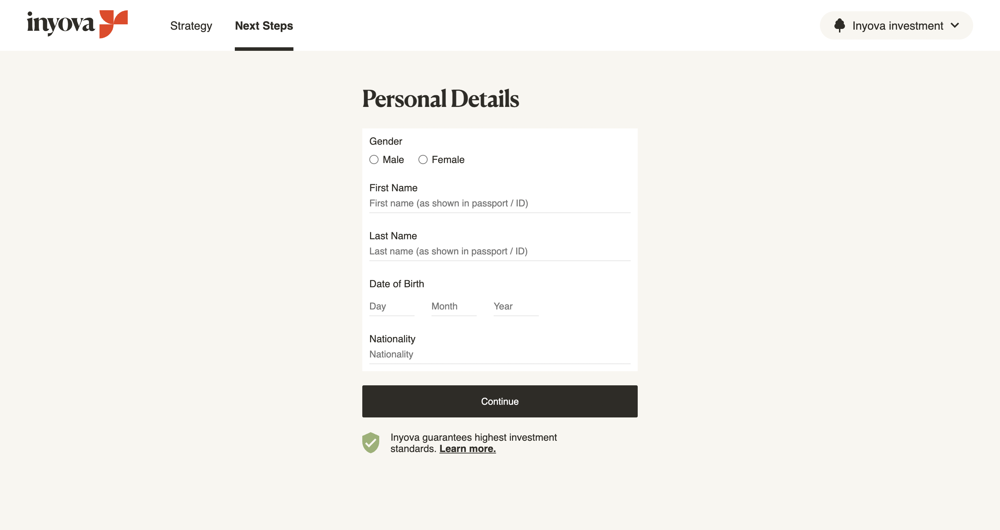

# InyovaAssignment

This project was generated with [Angular CLI](https://github.com/angular/angular-cli) version 15.2.6.

**Important**

Node and npm should have been configured within the project to avoid running into errors on project setup.
- node version: v16.17.0
- npm version: 8.15.0

**Assignment contains the following features of Angular:**

- Routing, Navigation (not optimized on mobile)
- Reactive Forms
- State management (prefered NgRx)

**Best practises used:**
- active links identification
- accessibility attributes

**Things to mention from the design:**
- removed burger menu icon for desktop
- notifications
  - no success message, because not shown in the designs
  - notification stays open until the form is corrected
- the navigation item "Next Steps" isn't really consistent, because the next-steps page shows actually the personal details form
- no further validation next to empty fields, because they aren't described in the designs
- radio buttons (kept defaults)
  - to stay consistent in terms of error highlighting (only labels)
  - if needed it can be implemented with pseudo-elements (after / before)
- buttons 'Book consultation' and 'Open account' will have contrast error in terms accessibility

**Most difficulties**
- getting to know Angular in general as it's the first time working with it
---
## Development server

Run `ng serve` for a dev server. Navigate to `http://localhost:4200/`. The application will automatically reload if you change any of the source files.

The application can be opened automatically in the browser with `ng serve -o`.

## Code scaffolding

Run `ng generate component component-name` to generate a new component. You can also use `ng generate directive|pipe|service|class|guard|interface|enum|module`.

## Build

Run `ng build` to build the project. The build artifacts will be stored in the `dist/` directory.

## Running unit tests

Run `ng test` to execute the unit tests via [Karma](https://karma-runner.github.io).

## Running end-to-end tests

Run `ng e2e` to execute the end-to-end tests via a platform of your choice. To use this command, you need to first add a package that implements end-to-end testing capabilities.

## Further help

To get more help on the Angular CLI use `ng help` or go check out the [Angular CLI Overview and Command Reference](https://angular.io/cli) page.
